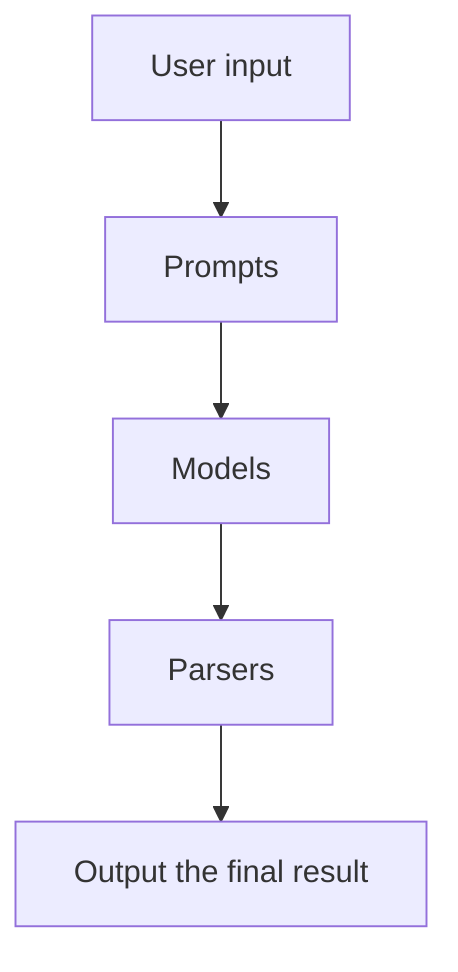

This is a personal notes from the course [Langchain for LLM application development](https://learn.deeplearning.ai/langchain/lesson/1/introduction). This one of the short courses offered by the [Deeplearning](https://deeplearning.ai).

It is mentioned as a 1 hour course, but it took me around 5 hours to complete the course. The course content was using openAI. I tried using Azure OpenAI in all the workbooks, attached the chapter workbook links along with a short excerpt for each chapter.

## Chapter 1: Models, Prompts and Parsers

- **Models** refers to the large language models
- **Prompts** refers to the text that you give to the model. Langchain offers an elegant way to construct these prompts. You can also construct your own prompts.
- **Parsers** refers to the code that you write to parse the output from the model. Langchain provides conventions, to define the parsers.

[Link to the workbook](https://github.com/prasann/langchain-deeplearning/blob/main/L1-prompts-models-parsers.ipynb)

## Chapter 2: Memory

**Memory** refers to the ability to store information and retrieve it later. This enables the user to have a chat like conversation with the LLMs.

Some of the `memory` options discussed in the course are:

- **ConversationBufferMemory** - It is the simplest option. Keeps storing all the conversations in the memory and keep sending them in as a context for the subsequent calls. However, this is not a good option because the memory keeps growing and the model will not be able to handle the large memory. Things gets slow and also the cost of the inference will be high.

- **ConversationBufferWindowMemory** - It is similar to the `ConversationBufferMemory`, but it keeps only the last `n` conversations in the memory. This is a better option than the `ConversationBufferMemory`, but still might not be the best. The first conversation of the chat could be very important, and losing that context might have consequences on the conversation.

- **ConversationTokenBufferMemory** - It is similar to that of `ConversationBufferWindowMemory`, but instead of storing `n` conversations it stores `n` tokens. Still have the same drawback of the `ConversationBufferWindowMemory`.

- **ConversationSummaryMemory** -  Here a summary of the previous conversations are generated and used that as a context for the subsequent calls. This is a better option than the previous ones.

## Chapter 3: Chains

Chains are simple wrapper around the Langchain components. It takes the user input, prompts, models and parsers and returns the output. It is a simple wrapper around the Langchain components.

**LLMChain** - A LLMChain is the most common type of chain. It consists of a PromptTemplate, a model (either an LLM or a ChatModel), and an optional output parser.

### **Sequential Chains**

Sequential chains allows to chain multiple `LLMChain` together.

**SimpleSequentialChain** - this allows the output of the first chain is used as the input for the second chain and so on.

**SequentialChain** -  this allows you to connect multiple `LLMChain` together and also allows you to connect them (input/output) as you wish.

### **Router Chains**

Router chains allows you to map the user input to a specific chain.

## Chapter 4: Question and answer

## Chapter 5: Evaluation

## Chapter 6: Agents
