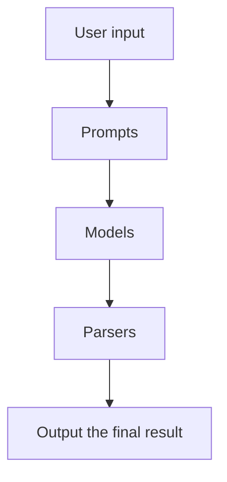

This is a personal notes from the course [Langchain for LLM application development](https://learn.deeplearning.ai/langchain/lesson/1/introduction). This one of the short courses offered by the [Deeplearning](https://deeplearning.ai).

It is mentioned as a 1 hour course, but it took me around 5 hours to complete the course. The course content was using openAI. I tried using Azure OpenAI in all the workbooks, attached the chapter workbook links along with a short excerpt for each chapter.

## Chapter 1: Models, Prompts and Parsers

- **Models** refers to the large language models
- **Prompts** refers to the text that you give to the model. Langchain offers an elegant way to construct these prompts. You can also construct your own prompts.
- **Parsers** refers to the code that you write to parse the output from the model. Langchain provides conventions, to define the parsers.

[Link to the workbook](https://github.com/prasann/langchain-deeplearning/blob/main/L1-prompts-models-parsers.ipynb)

## Chapter 2: Memory

**Memory** refers to the ability to store information and retrieve it later. This enables the user to have a chat like conversation with the LLMs.

Some of the `memory` options discussed in the course are:

**ConversationBufferMemory** - 
**ConversationBufferWindowMemory** - 
**ConversationTokenBufferMemory** - 
**ConversationSummaryMemory** - 

## Chapter 3: Chains

## Chapter 4: Question and answer

## Chapter 5: Evaluation

## Chapter 6: Agents